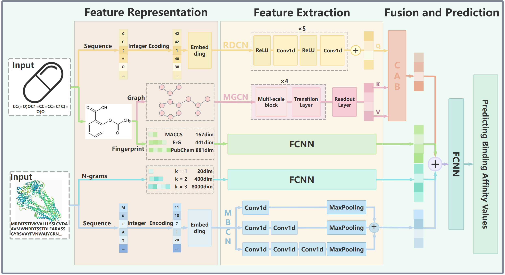

# MLFF-DTA: A Multi-Level Feature Fusion Method for Predicting Drug-Target Binding Affinity

## Model Architecture 



## Requirements

- The most important python packages are：
- einops==0.7.0
- matplotlib==3.7.2
- networkx==3.1
- numpy==1.25.2
- pandas==2.0.3
- prefetch_generator==1.0.3
- rdkit==2023.3.2
- scikit_learn==1.3.0
- torch==2.0.0
- torch_geometric==2.4.0

- tqdm==4.66.1

  

For using our model more conveniently, we provide the requirements file <requirements .txt>  to install environment directly.

```python
pip install requirements .txt
```

## Dataset

We use three datasets, i.e. DB_KD, DB_EC50 and Davis datasets. The DB_KD and DB_EC50  are constructed in our research.  The Davis dataset come from [TEFDTA]([lizongquan01/TEFDTA (github.com)](https://github.com/lizongquan01/TEFDTA))  (TEFDTA: a transformer encoder and fingerprint representation combined prediction method for bonded and non-bonded drug–target affinities). 

## Example usage

1. Preparing Training and Test Data 

   ```python
   python data_prepare.py Kd
   ```

   ```
   python data_generalizationSet_prepare.py Kd
   ```

2. Training the model

   ```python
   python main.py Kd
   ```

3. Testing  the model 

   ```python
   python test_model.py Kd
   ```

4. Evaluating  the generalization of the model 

   ```python
   python test_model_generalization.py Kd
   ```

## Contact

If you have any questions, please feel free to contact Jiao Wang (Email: wangjiao@mail.imu.edu.cn)